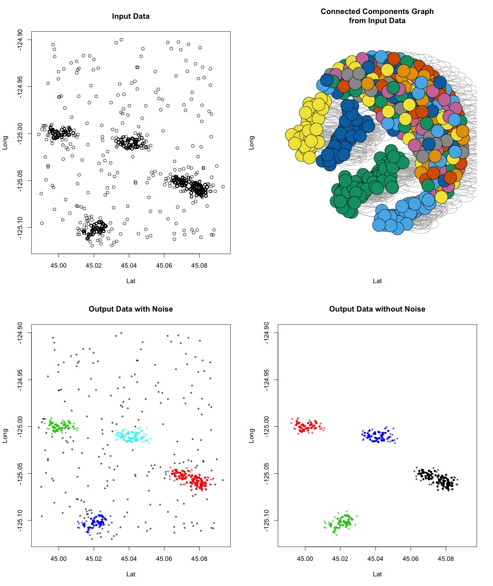
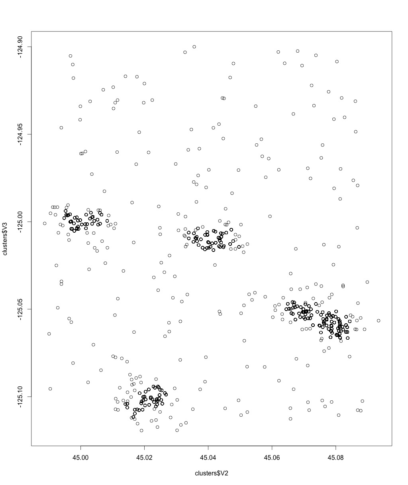
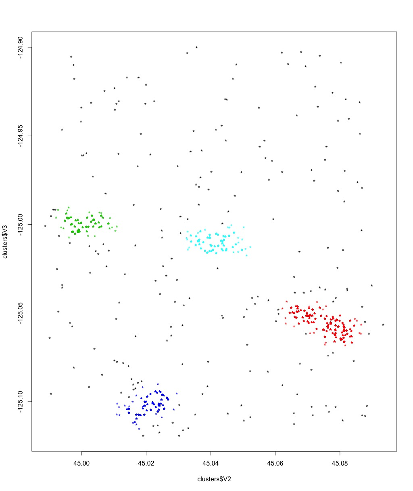
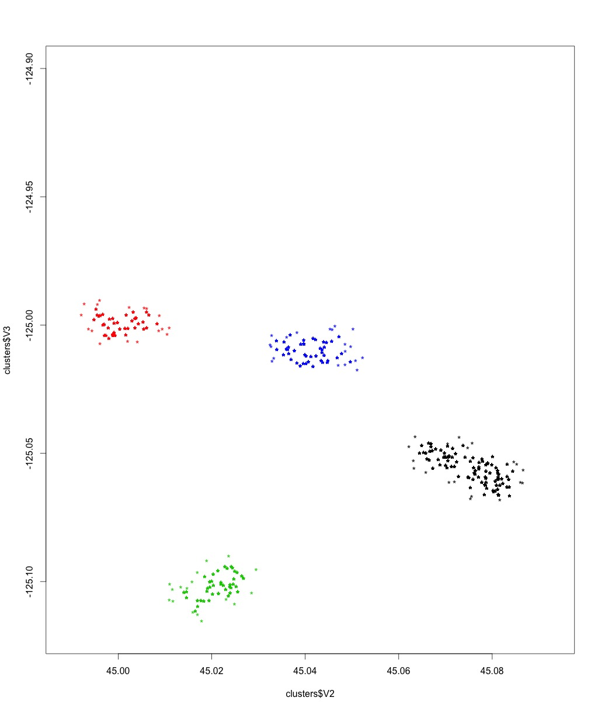

# spark-dbscan

DBSCAN clustering algorithm implemented in Apache Spark (MapReduce Framework)
for geographical data.

## Usage

**Input**: input_file.csv  with format (id,lat,long), minPts, epsilon (in meters)

**Output**: output_file.csv with format (id,lat,long,cluster_id)

**Note**: This Algorithm use a **KD-Tree** for a fast computation of all neighbors
under a given distance of a point (**ball search**).

# Algorithm

*DBSCAN* (Density-based spatial clustering of applications with noise) is a
clustering algorithm that clusters points according to a notion of density, i.e.
points in a dense areas are grouped together.

The density metric is specified in terms of how many neighbors (*minPts*) a
point must at least have at most distance *epsilon* in order to create a dense
area that will form a cluster.

Based on this definition we can have tree different type of points:

- *Core Points*: points that have at least **minPts** that are at most **epsilon**
far from it. They define a cluster.

- *Density-reachable Point*: points that don't have **mintPts** neighbors under
**epsilon**, but they have a **core-point** as neighbor. They belong to the same
cluster of the **core-point**.

- *Noise*: points that doesn't have neither **MinPts** points close up to distance **epsilon** nor a **core point**
 in its **epsilon-neighborhood**. This point are marked as noise since they are not in a sufficiently dense area.

## Input Data

## Output Data (Including Noise)

## Output Data (Without Noise)

